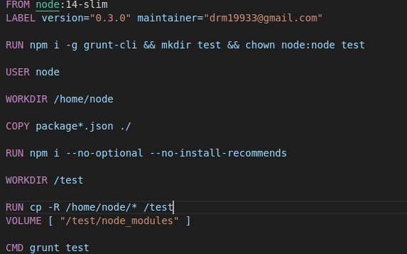
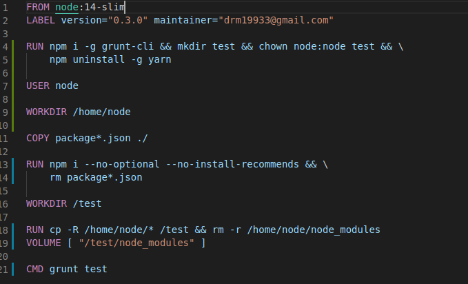

Esta es una imagen del primer Dockerfile creado siguiendo buenas practicas:

Y se ha optimizado:

- Se han buscado complemententos pre-instalados en la imagen como yarn y tras verificar que no los usamos los borramos.

- También se ha eliminado package.json y packaje-lock.json tras instalar dependencias puesto que ya no se van a utilizar mas

- Tambien se han borrado la carpeta con las dependencias de la carpeta del usuario tras crear volume en la carpeta test deseada.

