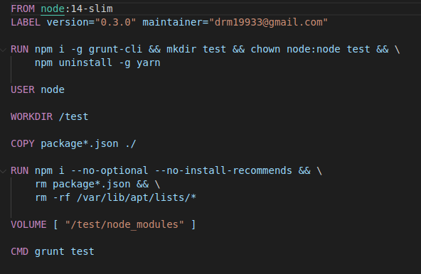

Esta es una imagen del primer Dockerfile creado siguiendo buenas prácticas:
 

 
Y se ha optimizado:
 
- Se han buscado complementos pre-instalados en la imagen como yarn y tras verificar que no los usamos los borramos.
 
- También se ha eliminado package.json y packaje-lock.json tras instalar dependencias puesto que ya no se van a utilizar más
 
- También se ha borrado la carpeta con las dependencias de la carpeta del usuario tras crear volumen en la carpeta test deseada.

Obteniendo el siguiente dockerfile

 
Siguiendo las buenas prácticas se ha intentando juntar los RUN, para generar menos capas y eliminar pasos obvios como copiar en el repositorio del usuario y copiar que a priori sería lo correcto pero como buscamos reducir el tamaño y el tiempo es lo óptimo.
 
