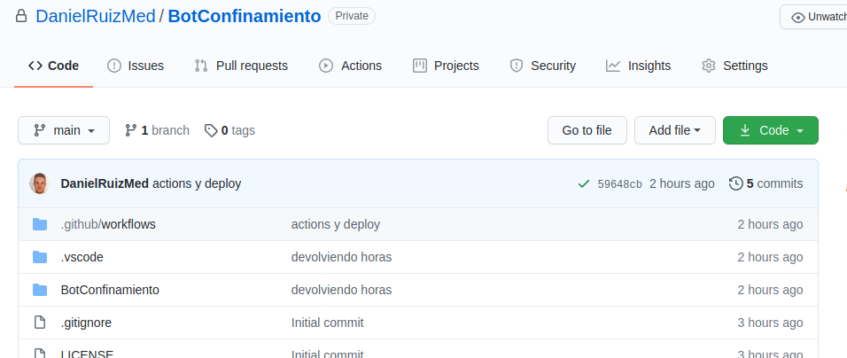
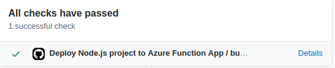
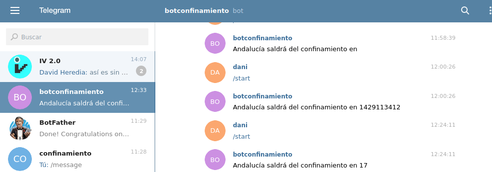

Se ha creado el repositorio y subido a Github

y se ha enlazado con una action para su deploy de forma continua en Azure functions

La función creada en JavaScript es la siguiente:

    //Se usado creado secretos en Github y se le han añadido los token necesarios para que funcione en el bot de telegram creado
    const Telegraf = require('telegraf')  
    const { TELEGRAM_BOT_TOKEN, WEBHOOK_ADDRESS } = process.env  
    
    const bot = new Telegraf(TELEGRAM_BOT_TOKEN, {telegram: { webhookReply: true }})  
    
    //Cuando el bot se inicia o recibe la palabra /start dice el tiempo en horas que queda para el confinamiento en Andalucia
    bot.start((ctx) => {

        var fin_cuarentena = new Date("December 10, 2020 23:59:00");
        var hoy = new Date();
        var tiempo = "NO está confinada";

        if( hoy < fin_cuarentena ) tiempo = Math.round((fin_cuarentena - hoy)/ (1000*60*60));
            
        ctx.reply('Andalucía saldrá del confinamiento en '+tiempo +"horas");
    });

    module.exports = async function (context, req) {  
        return bot.handleUpdate(req.body, context.res) 
    }

que se encuentra en [su repositorio](https://github.com/DanielRuizMed/BotConfinamiento/blob/main/BotConfinamiento/index.js)

Tras subir la función en Azure functions, si vamos al chat de telegram @confinamiento2bot
y escribimos lo dicho anteriormente:

