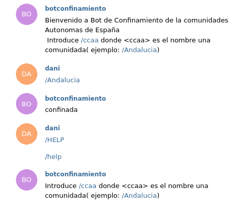

Se ha creado el repositorio y subido a Github

y se ha enlazado con una action para su deploy de forma continua en Azure functions

La función creada en JavaScript es la siguiente

que se encuentra en [su repositorio](https://github.com/DanielRuizMed/BotConfinamiento/blob/main/BotConfinamiento/index.js)

Tras subir la función en Azure functions, si vamos al chat de telegram @confinamiento2bot
y escribimos las palabras esperadas:

