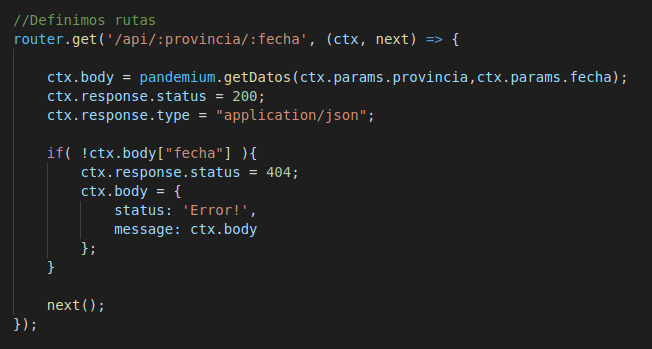
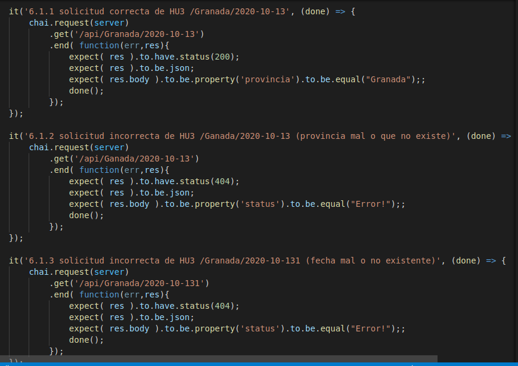

## Implementación del código
---
 
Puesto que ya tenemos creada una clase controladora [pandemiun.js](../src/class/pandemiun.js) la cual gestiona las clases [ListadoContagios.js](../src/class/ListadoContagios.js) y [ListadoUsuarios.js](../src/class/ListadoUsuarios.js).
 
Se ha generado el siguiente código donde con ayuda de los middleware de Koa:
- Koa-router: se ha definido la ruta de consulta con el verbo GET usando su método .get() e incluyendo en su path las variables que deseamos recoger.
- Koa-body nos rediseña el nodo recibido con los parámetros y respuesta facilitandonos con un simple punto la obtención de las variables.
 

 
Llamamos al método getDatos() de la clase controladora pandemiun.js, el cual controla que tanto la fecha pasada y provincia sean correctas. Si es correcto nos devolverá un json con la respuesta, de lo contrario nos mandará un mensaje indicando el tipo de error. Este lo adjuntamos al body (también en formato json) para devolver un Error e informar que los parámetros no son los correctos o no existen datos sobre los mismos.
 
También indicamos que el tipo de respuesta está en formato JSON y que devolvemos el código 200 si todo es correcto o 404 si los parámetros no son los correctos o no existen datos sobre ellos.
 
El código completo está en [index.js](../src/index.js)

Se ha implementado la ruta y devolución de datos atendiendo los requerimientos de la [HU3](https://github.com/DanielRuizMed/PAndemium/issues/38).

## Implementación de test
---
 
Este es el código para los test, utilizando mocha , chai y en especial chai-http que ayuda a la hora de hacer test sobre peticiones con verbos http como get, put,... de la API.
 

 
Se realizan 3 test:
 
1. Comprueba si pasando una provincia y fecha existentes el resultado devuelto está en formato JSON, tiene el código 200 y el json devuelto contiene el atributo provincia con valor Granada que es el enviado en el path.
 
2. Verifica que si pasamos una provincia errónea o que no existe, la respuesta será en formato JSON con el código 404 y que el json contiene el atributo status con valor Error! indicando que devuelve lo que deseamos.
 
3. Verifica igual que el anterior si la fecha no está en el formato correcto o no existe, devolviendo en formato JSON el código 404 y el atributo status con el valor Error!.