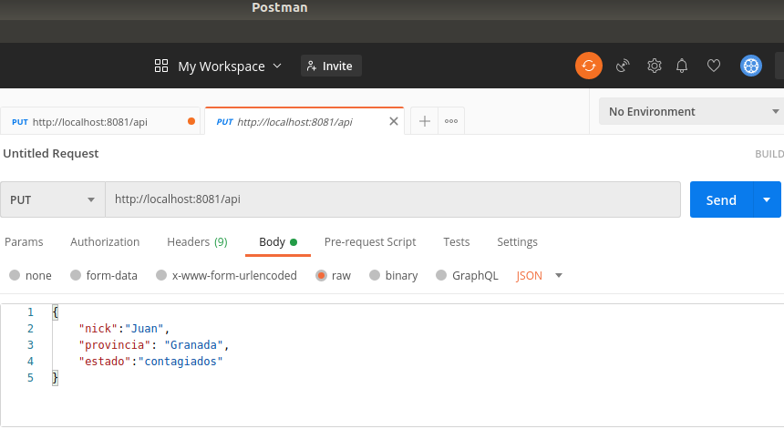

## Implementación del código
---

Puesto que ya tenemos creada una clase controladora [pandemiun.js](../src/class/pandemiun.js) la cual gestiona las clases [ListadoContagios.js](../src/class/ListadoContagios.js) y [ListadoUsuarios.js](../src/class/ListadoUsuarios.js).

Se ha generado el siguiente código donde con ayuda de los middleware de Koa:
- Koa-router: se ha definido la ruta de consulta con el verbo PUT usando su método .put().
- Koa-body: nos rediseña el nodo recibido con los parámetros y respuesta facilitandonos con un simple punto la obtención de las variables.

 
Donde con los parámetros nick, provincia y estado, pasados, se intentará actualizar los datos de existir y de los contrario se creará. Para esto se hace uso de los métodos de la clase pandemiun.js updateDatos() y addDatos() los cuales comprueba si los parámetros pasados son los correctos y realizan su función.
 
También indicamos que el tipo de respuesta está en formato JSON y que devolvemos el código 200 si todo es correcto o 404 si los parámetros no son los correctos o no existen datos sobre ellos.

El código completo está en [index.js](../src/index.js)
 
Se ha implementado la ruta y devolución de datos atendiendo los requerimientos de la [HU4, actualizar datos](https://github.com/DanielRuizMed/PAndemium/issues/39) y [HU5, registrar nuevos usuarios y actualizar estado](https://github.com/DanielRuizMed/PAndemium/issues/40).
 
Para ir probando que lo implementado cumplia con lo deseado, antes de implementar los test se ha usado Postman para crear las diferentes peticiones PUT y json que enviamos con dicha petición.
 

 
## Implementación de test
---

Este es el código para los test, utilizando mocha , chai y en especial chai-http que ayuda a la hora de hacer test sobre peticiones con verbos http como get, put,... de la API.

Se realizan 4 test, utilizando el método .put() de chai-http para indicar que el verbo es PUT y enviando con .send() un json con los datos necesarios y añadiendo con .set() que el tipo es json:

1. Comprueba pasando un json con los atributos nick, provincia y estado, si todos son correctos, la respuesta devuelta es json y tiene el código es 200. Los datos pasado coinciden con los ya existentes en la simulación de base de datos de los ficheros [usuarios.js](../src/json/usuarios.json) y [provincias.js](../src/json/usuarios.json)

2. Verifica que si pasamos una provincia errónea o que no existe, la respuesta será en formato JSON con el código 404 y que el json contiene el atributo status con valor Error!, indicando que devuelve lo que deseamos.

3. Verifica que si modificamos la provincia de un usuario existente la respuesta es en formato json con el código 200.
 
4. Comprueba que si se pasa un usuario no existente, este es creado en la base de datos y se devuelve un json y el código 200.