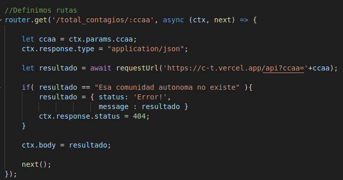
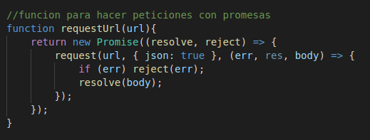
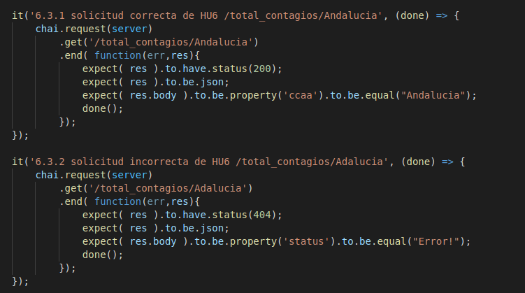

## Implementación del código
---
 
Puesto que ya tenemos creada una clase controladora [pandemiun.js](../src/class/pandemiun.js) la cual gestiona las clases [ListadoContagios.js](../src/class/ListadoContagios.js) y [ListadoUsuarios.js](../src/class/ListadoUsuarios.js).
 
Se ha generado el siguiente código donde con ayuda de los middleware de Koa:
- Koa-router: se ha definido la ruta de consulta con el verbo PUT usando su método .put().
- Koa-body: nos rediseña el nodo recibido con los parámetros y respuesta facilitandonos con un simple punto la obtención de las variables.
 
También se ha utilizado la librería request para realizar las peticiones asíncronas al serverless implementado.
 

El método recibe el parámetro ccaa(comunidad autónoma) y con la función requestUrl() que se explica más adelante se hace la petición, devolviendo el resultado y código 200 si todo ha ido bien desde el serverless desplegado en Vercel. Si se recibe que la comunidad pasada no existe o no hay datos se devuelve el código 404.
 
Se ha utilizado async y await para hacer una petición a Vercel y esperar la respuesta, ayudado de la creación de una promesa con la función requestUrl() siguiente:
 

 
El código completo está en [index.js](../src/index.js)

Se ha implementado la ruta y devolución de datos atendiendo los requerimientos de la [HU6, consultar número de contagios en una comunidad autónoma](https://github.com/DanielRuizMed/PAndemium/issues/83).

## Implementación de test
---
 
Este es el código para los test, utilizando mocha , chai y en especial chai-http que ayuda a la hora de hacer test sobre peticiones con verbos http como get, put,... de la API.
 

 
Se realizan 4 test, utilizando el método .get() de chai-http :
 
1. Comprueba que si indicamos una comunidad autónoma correcta el resultado es un json con el atributo ccaa y valor dicha comunidad. También se verifica que su código sea 200.
 
2. Verifica que si pasamos una comunidad autónoma errónea o que no existe, la respuesta será en formato JSON con el código 404 y que el json contiene el atributo status con valor Error!, indicando que devuelve lo que deseamos.