Para medir el tiempo en lanzar las ordenes he utilizado la orden **time** de linux.

El Dockerfile de las imagenes es diferente al actual, ya que en el incluia todo el programa. En el actual solo se incluyen los test y se carga los ficheros a testear con las opción `-v` de `docker run`.

1. **node:14**

EL tamaño tras construir la imagen es:

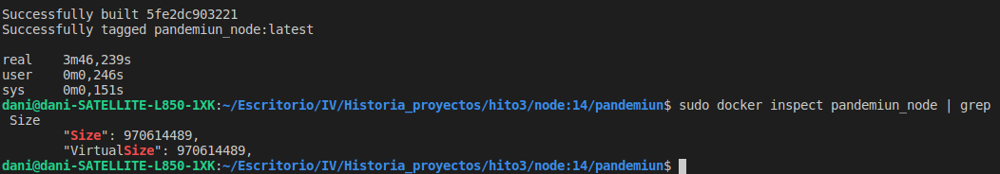

EL tiempo de construir es:

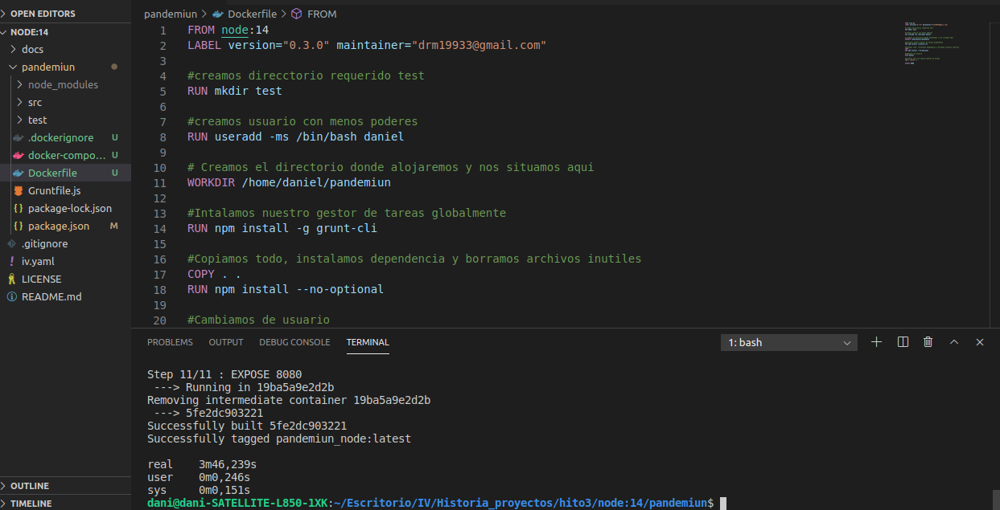

EL tiempo de ejecucción es:   

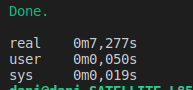

2. **node:14.14.0-alpine3.10**

EL tamaño tras construir la imagen es:

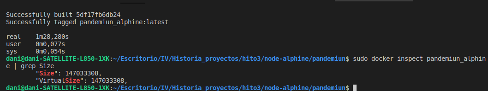

EL tiempo de construir es:

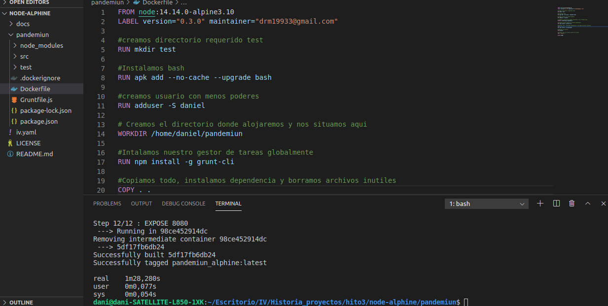

EL tiempo de ejecucción es:

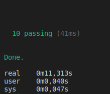

3. **node:14-slim**

EL tamaño tras construir la imagen es:

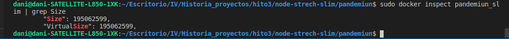

EL tiempo de construir es:

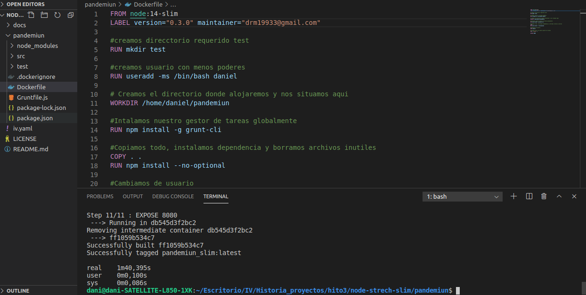

EL tiempo de ejecucción es:

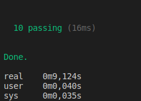

4. **digitallyseamless/nodejs-bower-grunt**

EL tamaño tras construir la imagen es:

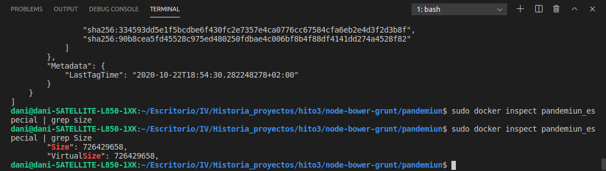

EL tiempo de construir es:

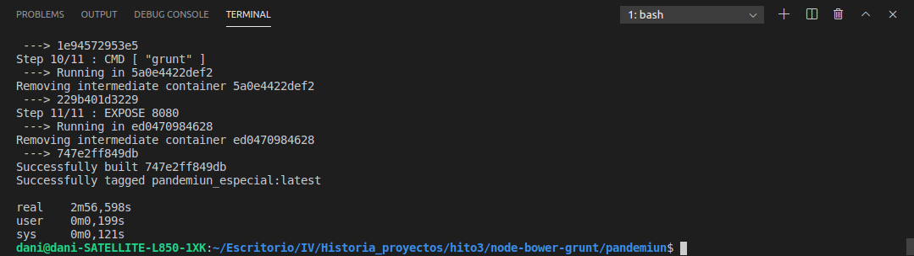

EL tiempo de ejecucción es:

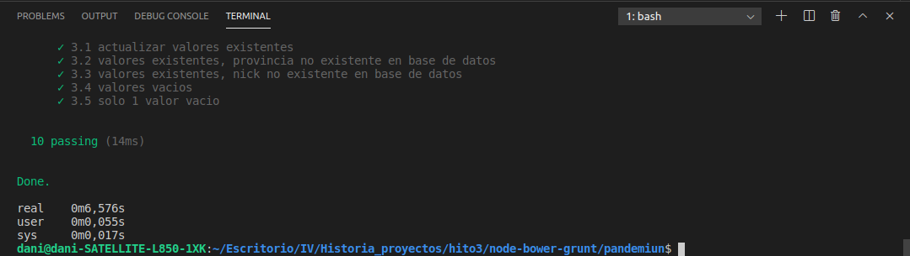 