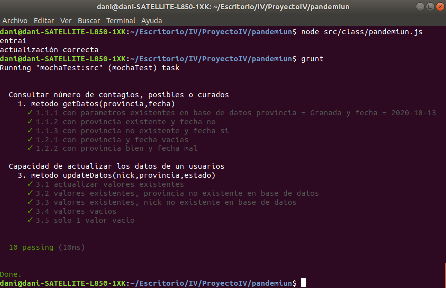
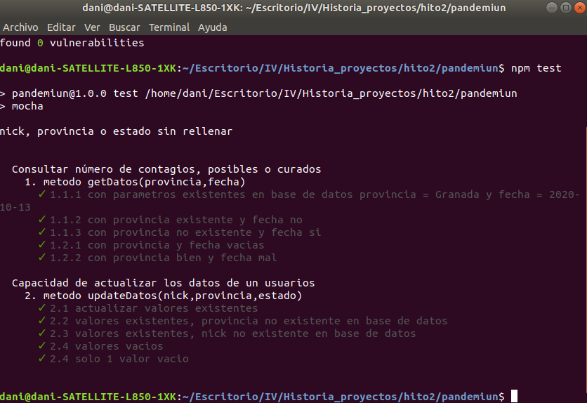

### Despliegue

Ejecutamos la clase principal (provisional hasta montar la API REST)

	cd pandemiun

	node src/class/pandemiun.js

### Test con grunt

	cd pandemiun

	grunt
	
Imagen con resultado de ejecución

### Test (otra forma)
Primero nos descargamos todas las dependencias

	cd pandemiun

	npm install

Después escribimos:

	npm test

Imagen con resultado de ejecución
