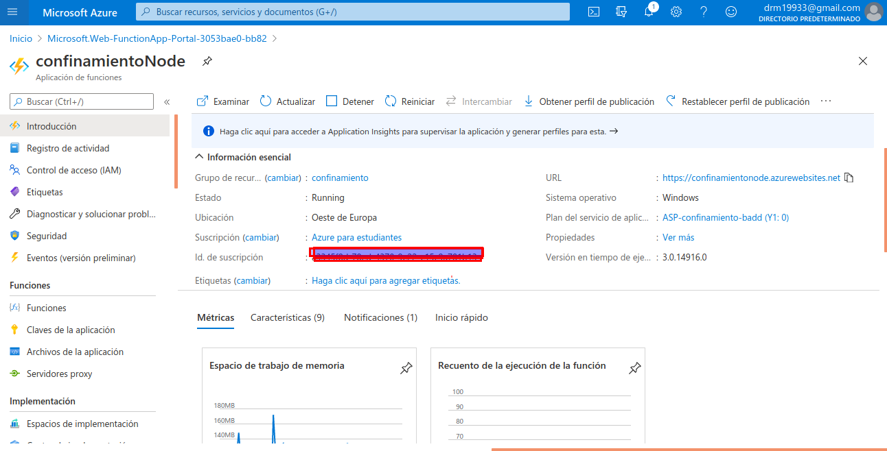

[<< Volver a Readme](../Readme.md)
---

Para realizar su despliegue de forma correcta nos hemos registrado en Azure functions y nos vamos a nuestro portal.

Y tenemos dos opciones crear nuestro proyecto desde aqui y luego subirlo con una extensión de Visual Studio Code:
 

 
O la utilizada para su **despliegue de forma continua**, creando un Actions en Github para que cuando reciba un push se realice un deploy en Azure Functions. Para esto se ha tenido que crear un Secreto con un token de autenticación de Azure para su uso en las Actions.
 
Se ha creado la siguiente [Actions](https://github.com/DanielRuizMed/confinamiento3/blob/main/.github/workflows/azure_deploy.yml)

Ejemplo de push a nuestro proyecto con deploy en Azure functions

Para su correcto **funcionamiento** se ha creado la siguiente función, siguiendo las recomendaciones de la documentación de Azure sobre una función en Python. (No se pasa el nombre de las comunidades con acentos ni caracteres extraños por no reconocer estos)
    # Importamos las librerías que vamos a utilizar, en nuestro caso json por tratar con datos de ese tipo
    import logging
    import json
 
    import azure.functions as func
 
    # json con valores
    x = '{ "Andalucia":"confinada","Murcia":"confinada","Sevilla":"confinada","Canarias":"no confinada"}'
 
    # transformamos en json
    datos = json.loads(x)
 
    # función main que será nuestro 'handler' para Azure functions
    def main(req: func.HttpRequest) -> func.HttpResponse:
 
        ccaa = req.params.get('ccaa')
 
        # vemos si existe el parámetro ccaa para extraer los resultado de existir en los datos json
        if ccaa:
            result = datos.get(ccaa, 'No hay datos con esa comunidad o no existe')
            codigo = 200
 
        else:
            result = "Nos has puesto bien los atributos, ejemplo: ?ccaa=Andalucia."
            codigo = 404
 
 
        return func.HttpResponse(
            result,
            status_code=codigo
        )

Y tras su subida a github y despliegue continuo en Azure functions se nos da el siguiente enlace [https://confinamientopandemium.azurewebsites.net/api/Confinamiento?ccaa=Andalucia](https://confinamientopandemium.azurewebsites.net/api/Confinamiento?ccaa=Andalucia), donde pasando la comunidad podemos obtener el resultado deseado:

 
 
# Enlaces
 
- [Repositorio de confinamiento, Mini-Api contruida para Azure](https://github.com/DanielRuizMed/confinamiento3)
- [función creada](https://github.com/DanielRuizMed/confinamiento3/blob/main/Confinamiento/__init__.py)
 
---
[<< Volver a Readme](../Readme.md)