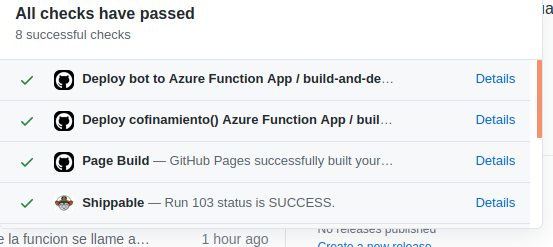

Primero creamos nuestro proyecto en Azure functions

Para su despliegue continuo se ha creado la siguiente [Actions](https://github.com/DanielRuizMed/PAndemium/blob/master/.github/workflows/main.yml)

Ejemplo de push a nuestro proyecto con deploy en Azure functions

La función implementada ha sido confinamiento() de la clase [ListadoContagios](../src/class/ListadoContagios.js), en la imagen siguiente se muestra la función generada con su código de estado y mime.

   

Y tras su subida a github y despliegue continuo en Azure functions se nos da el siguiente enlace [https://confinamientonode.azurewebsites.net/api/confinamientoPan?ccaa=Murcia](https://confinamientonode.azurewebsites.net/api/confinamientoPan?ccaa=Murcia), donde pasando la comunidad podemos obtener el resultado deseado:

