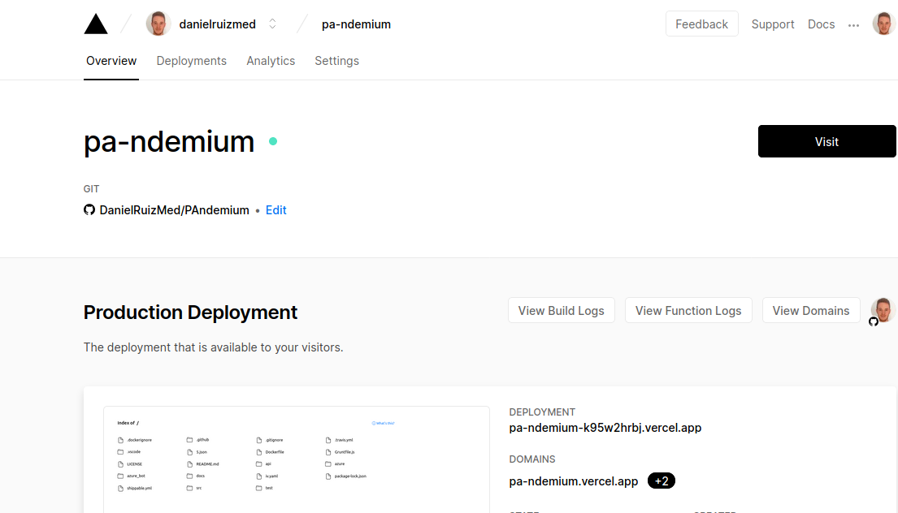

 
Para realizar su despliegue de forma correcta nos hemos registrado en Vercel con nuestra cuenta de Github, otorgando permisos.
 

 
En nuestro perfil de vercel clicamos en importar e indicamos la url de nuestro proyecto de Github que deseamos importar.
 

 
Tras esto se importa el proyecto y se realiza el deploy sobre las direcciones proporcionadas.
 

 
La facilidad de Vercel es que cuando indicamos el proyecto a importar, si no tenemos instalado Vercel como integración en nuestro proyecto, se instala para que cada vez que se realice un push o pull_request a nuestro repositorio de Github se actualice en Vercel. (**despliegue continua**)
 

 
Ejemplo de push a nuestro proyecto con deploy en Vercel
 

 
La funcion que se ha subido es la siguiente, que pertenece a [ListadoContagios](../src/class/ListadoContagios.js), a la que se le ha añadido el código de estado segun la respuesta de la función y el formato mime. Esta es la [función subida a vercel](../api/index.js).

 
Y tras su subida a github y despliegue continuo en Vercel se nos da el siguiente enlace [https://pa-ndemium.vercel.app/api?ccaa=Andalucia](https://pa-ndemium.vercel.app/api?ccaa=Andalucia), donde pasando la comunidad autonoma podemos obtener el resultado deseado:
 
