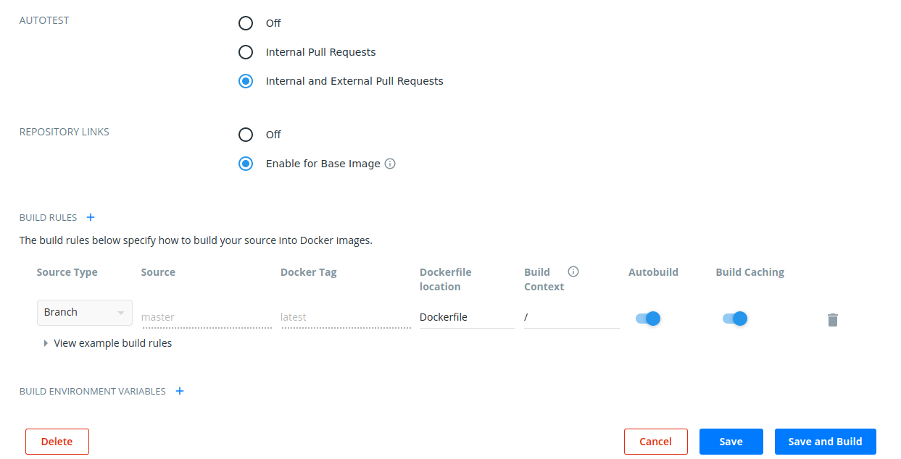
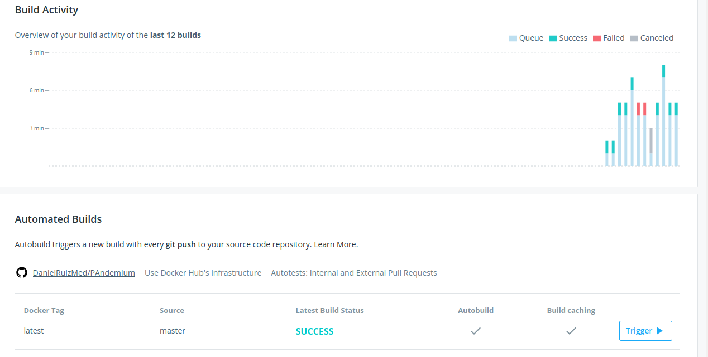

Para que nuestro docker se actualice de forma automática cuando modificamos Dockerfile en GitHub lo que hacemos es conectar nuestra cuenta con Github y crear un build con los siguiente:

Indicando donde se va a encontrar Dockerfile en nuestro repositorio

Y esto es lo que va produciendo cada vez que modificamos el Dockerfile en Github

