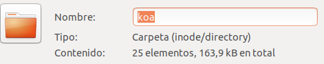
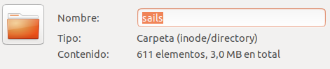
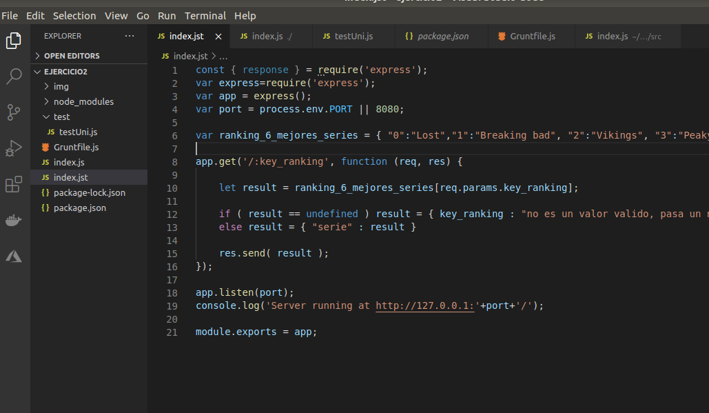
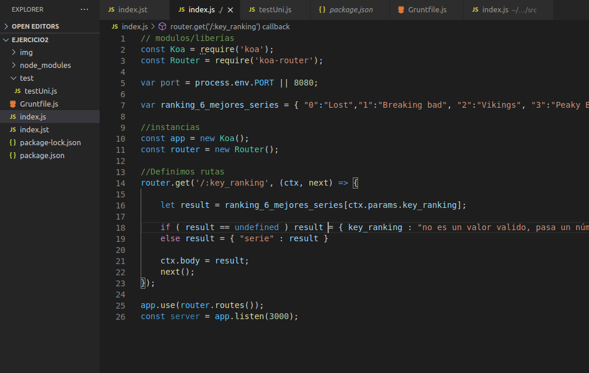
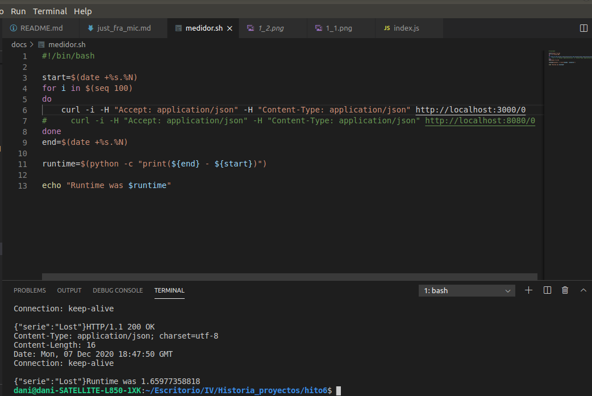
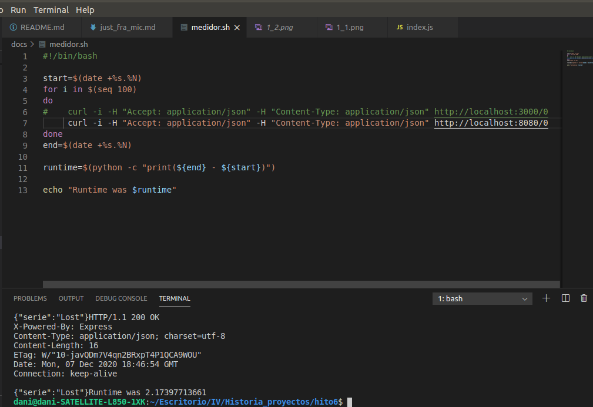

Lo primero que hice fue buscar y documentarme sobre los mejores framework para resolver mi problema en Nodejs a la hora de realizar una API REST, rutas, middleware, ...
 
Buscando entre sus características las que más se adaptan para resolver mi problema. Eligiendo y comparando Sails, Express y Koa.js como framework para mi API.
 
Sails fue rápidamente descartada ya que aunque es un framework mucho más completo es menos flexible y además está construido sobre Express. Si utilizaba Sails usabas Express.
 
Comparando las características de Koa y Express me decanté por Koa ya que su tamaño es más liviano y no proporciona ningún enrutamiento, plantilla,.. instalado. Si no que nos da la opción de una total personalización sobre los middleware que deseamos usar.
 
Pero tratando de tomar mis propias conclusiones realice análisis de tamaño y tiempo de consulta para elegir verdaderamente el que mejor se adapte a mi problema y de mejores resultados.
 
Primero verificaremos si como dicen KOA es tan liviano como indican.
 
Tamaño de koa (tras instalación con npm):

 
Tamaño de express (tras instalación con npm):

 
Tamaño de sails (tras instalación con npm):

 
Donde podemos ver que Koa gana significativamente y realmente es tan liviano como indican y descartando el uso de Sails
 
Para las pruebas de rendimiento he utilizado el ejemplo realizado en los ejercicios con Express, reinvirtiendo el mismo código para KOA.
 
Código con el framework Express utilizado para la prueba de rendimiento.

 
Código con el framework Koa utilizado para la prueba de rendimiento.

 
Como el comando time depende mucho de las tareas que esté ejecutando linux en el momento se ha creado el siguiente [script](medidor.sh) con el cual se ha medido la muestra de 100 peticiones a diferentes APIS.
 
Esta es la prueba de tiempo para la API con Koa, donde podemos ver que el tiempo es mucho inferior que Express.

 
Esta es la prueba de tiempo de la API con Express, donde se puede apreciar que su tiempo es mucho mayor que koa.

 
Por lo tanto, ya que sus características y pruebas son perfectas para cumplir con los requerimientos de mi API , he elegido Koa.js como framework, aparte de poder utilizar mi framework de test (Chai, Chai-http) para poder realizar los test.

---

## Middleware utilizados

- koa-router: para facilitar el enrutamiento, ya que dispone de método .get, .put, .post que facilitan la creación de las rutas. [Documentación](https://github.com/ZijianHe/koa-router) utilizada.

- koa-body: ya que "formatea" o rediseña la respuesta recibidas en las rutas para facilitar el tratamiento de datos en un formato json, además de funcionar perfectamente con Koa-router. [Documentación](https://github.com/dlau/koa-body) utilizada

## Herramienta

He usado tambien request, para crear la promesa en [index.js](../src/index.js) y poder hacer que nuestra API realice peticiones a los serverless desplegados anterior mente en Vercel y Azure functions, relativo a las [HU6](https://github.com/DanielRuizMed/PAndemium/issues/83) y [HU7](https://github.com/DanielRuizMed/PAndemium/issues/84).