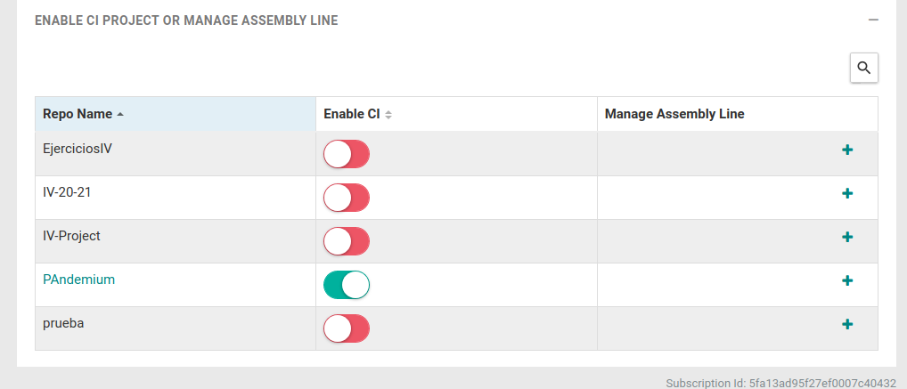

# Shippable
 
La razón por la que he decidido aprender a utilizar shippable, aunque no hay mucha documentación sobre posibles fallos en internet y solucionar estos es complicado, tiene un potencial enorme en la realización de diferentes jobs ya que estos pueden realizar tareas y comunicarse con otros jobs. Se pueden crear dependencias entre jobs, haciendo que algunos jobs esperen la finalización de otros jobs por necesidad de recursos de los mismos.
 
Primero me he registrado con nuestra cuenta de github
 

 
y le hemos otorgado autorización de nuestros datos públicos y algunas permisos requeridos
 

 
Tras esto buscamos el la barra lateral nuestro nombre en github y le indicamos el repositorio
 

 
Tras esto creamos un fichero llamado [shippable.yml](../shippable.yml) el cual utiliza la web shippable para saber que debe realizar sobre nuestro repositorio, el cual he definido con la siguiente estructura:
 
    #Definimos el lenguaje que se va a utilizar, en nuestro caso Nodejs y las versiones explicadas en travis
    language: node_js
 
    node_js:
       - 15
       - 14
       - 12
       - 10
 
    #le indicamos los que realizar, cada build tiene ci,pre_ci,post_ci,in,out,... lo cual le da mucho poder a shippable con todas las tareas que puede realizar
    build:
        ci:
           - npm i
           - npm i -g grunt-cli
           - grunt test
 
   #También permite crear jobs y definir dependencias con sus diferentes jobs en nuestro caso no las hay
    jobs:
       - name: creando build de la imagen
       type: runSh
       dependencyMode: chrono
       steps:
       TASK:
           - script: docker build -t danielruizmed/pandemium .
 
    #Ponemos que no se envien notificaciones por email
    notifications:
       email: false
 
Tras esto cada vez que realizamos un push a Github podemos ver su interacción con sippable desde
github:
 

 
o desde shippable donde podemos analizar mejor los resultados
 

