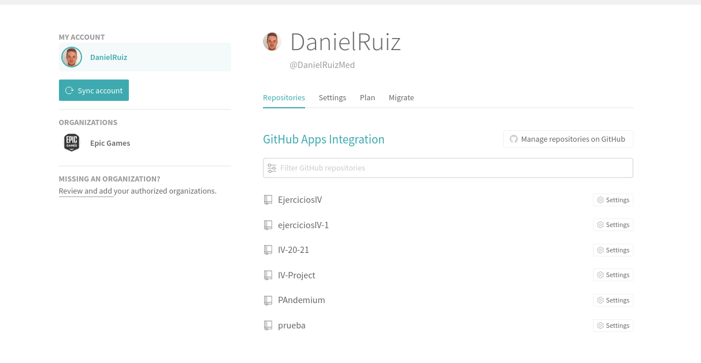
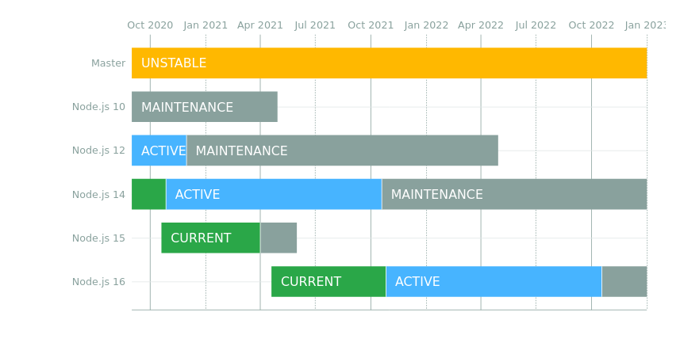
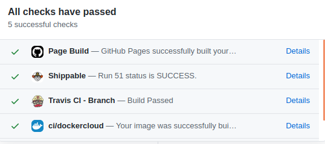
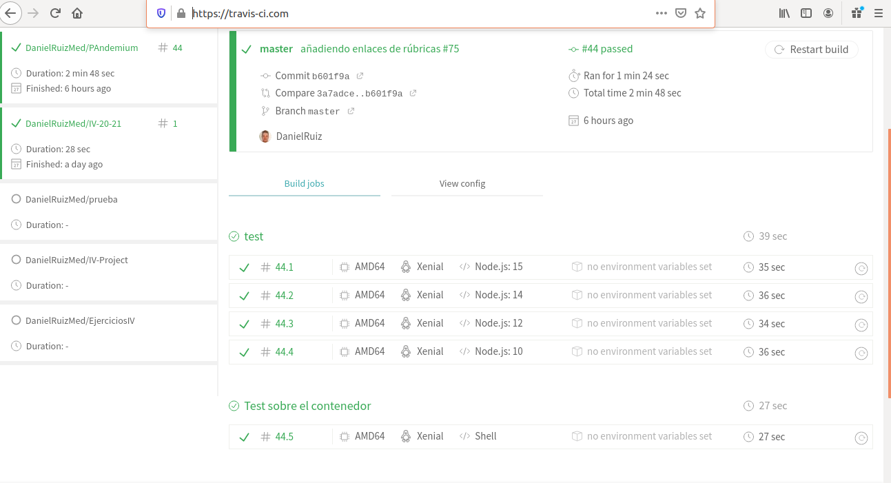

# Travis
 
Lo primero nos hemos registrado y vinculado nuestro repositorio de proyecto con [travis](https://travis-ci.com/), para que cada vez que realicemos un push a dicho repositorio en Github se envíe una request a travis.
 

 
EL fichero que utiliza travis para saber o conocer qué labores ha de realizar es [.travis.yml](../.travis.yml), el cual he definido con la siguiente estructura:
 
    #Definimos el lenguaje que se va a utilizar, en nuestro caso Nodejs
    language: node_js
 
    #Definimos las versiones en las que deseamos probar en travis (se explica adelante)
    node_js:
       - 15
       - 14
       - 12
       - 10
 
    #Le decimos que deseamos realice antes de script, en nuestro caso instalar grunt globalmente
    before_script:
       - npm install -g grunt-cli
      
    #y lanzamos con nuestro task runner ejecutamos los test
    script: grunt test
 
    #Como deseamos también verificar que nuestro contenedor de DockerHub sigue cumpliendo con los requisitos deseados se hace un job, con el lenguaje minimal ya que lo que deseamos es hacer funcionar docker y este ya contiene todo.
    jobs:
        include:
           - stage: "Test sobre el contenedor"
           language: minimal
           services: docker
           before_script: docker pull danielruizmed/pandemium
           script: docker run -t -v `pwd`:/test danielruizmed/pandemium
 
    #Hemos modificado las notificaciones cuando se producen todo estas pruebas de forma correcta o incorrecta para que no nos envie ningun mensaje
    notifications:
        slack:
           on_success: never
           on_failure: never
 

 
Hemos decidido utilizar estas versiones ya que en la [página oficial de node](https://nodejs.org/es/about/releases/) nos indica las versiones que están activas, las que siguen en mantenimiento y las que desaconsejan. He elegido estas porque son las que se siguen manteniendo.
 

 
Una vez creado este fichero cada vez que realicemos push github y travis se comunican para realizar los escrito en .travis.yml, viendo los resultados desde github abriendo nuestro commit
 

 
Tambien podemos ir a travis-ci.com y que todo se ha pasado correctamente o ver los fallos encontrados
 

 
Lo que me ha decantado a utilizar travis ha sido su facilidad para encontrar soluciones a fallos en internet, su fácil creación de distintos jobs, rapidez de ejecución y facilidad de integración con Github.
