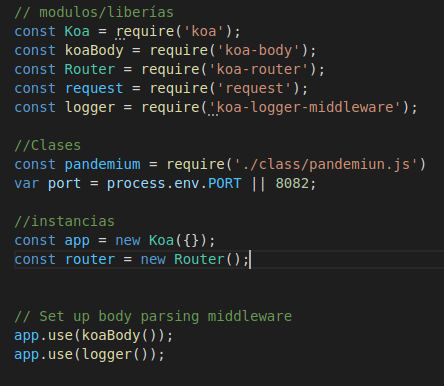
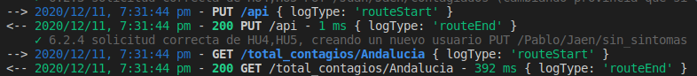
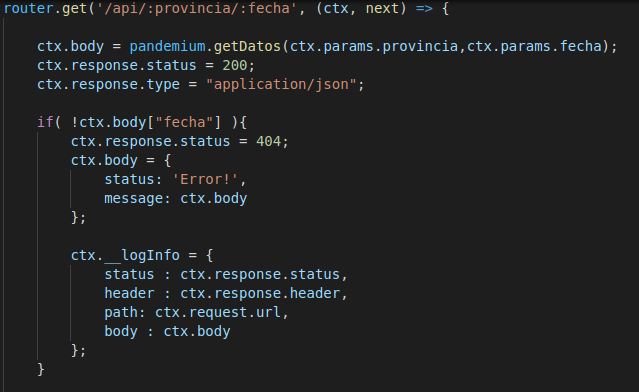

Lo primero que hacemos es lo común cuando trabajamos con Koa.js, requerimos el módulo y los añadimos a los middleware.
 

 
Con lo anterior cada vez que se realice una petición y una respuesta, se seguirá sus logs para conocer que está haciendo la API en cada momento.
 

 
Después buscando conocer los tipos de errores que se produzcan en la aplicación se ha impreso por log los detalles de todas las veces que el código devuelto no sea 200.
 

 
El sistema de logs se suele descentralizar, generando ficheros logs en sitios remotos o usando sistemas de logs como papertrail, yo aun no he decidido que sistema utilizar.
