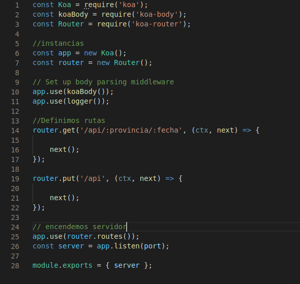

## Uso framework, diseño API y rutas
---
 
La **estructura general** con la que se ha creado el microservicio con koa es la siguiente:
 

 
En donde lo primero que hacemos es requerir koa y los módulos necesarios para facilitarnos la creación
del microservicio, koa-router y koa-body. Después creamos nuevas instancias de estos módulos requeridos y se los añadimos como middleware a Koa mediante app.use().
 
Luego hemos definido las rutas get y put (pedidas en las Historias de usuario), para así responder las diferentes peticiones de los usuarios. Se ha decidido incluir todo en el mismo fichero puesto que nuestro microservicio cuenta con 4 rutas y nuestro objetivo es utilizar los mínimo, en el caso de ser una aplicación con planes de continuar su desarrollo lo más recomendable sería tener las rutas en un documento diferente.
 
Por último hacemos que nuestro API escuche en una dirección y puerto. Se hace module.export de server para su uso posterior en la creación de test de integración.
 
La API se ha **diseñado** con el siguiente esquema, buscando separar la lógica de negocio y tratamiento de datos de la API, buscando un diseño por capas:
 

 
Donde según la ruta o recurso solicitado, la API realizará distintas acciones:
 
- GET ~/api/:provincia/:fecha~ -> El [controlador](../src/index.js) del microservicio buscará si dicha ruta coincide con alguna de las creadas, tras encontrarla se utilizara el método necesario de la clase [Pandemiun.js](../src/class/pandemin.js) (controladora) encargada de la lógica de negocio y que a su vez utilizará las clases necesarias ([ListadoUsuarios.js](../src/class/ListadoUsuarios.js) o [ListadoContagios.js](../src/class/ListadoContagios.js)) para operar con los datos. Tras esto devolverá el código 200 y respuesta json si todo es correcto o código 404 y respuesta json si las variables del path no existen o son erróneos.
- PUT ~/api~ y json con { nick : "", provincia : "", estado : "" }-> siguiendo el mismo proceso que el anterior, pero en este caso debido al verbo HTTP, se utilizaran los métodos de actualizar y guardar de la clase [pandemium.js](../src/class/pandemin.js) que conoce con qué clases debe utilizar para que se operen con los datos, devolviendo el código 200 y respuesta json si todo es correcto o código 404 y respuesta json si las variables del path no existen o son erróneos.
- GET ~/confinamiento/:ccaa~ -> El [controlador](../src/index.js) del microservicio buscará si dicha ruta coincide con alguna de las creadas, en su caso y siguiendo la HU7 se realiza la petición al serverless desplegado en Azure functions, devolviendo el código 200 o 404 y la respuesta json.
- GET ~/total_contagios/:ccaa~ -> siguiendo los mismo paso que el anterior solo que este serverless está desplegado en Vercel.